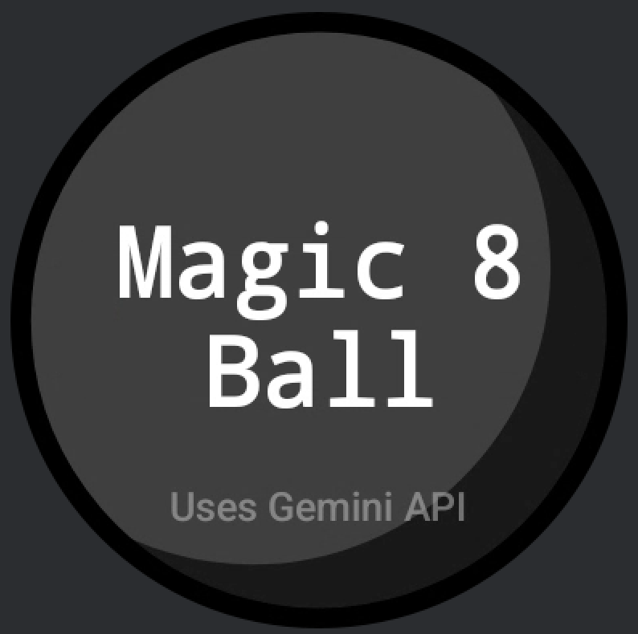
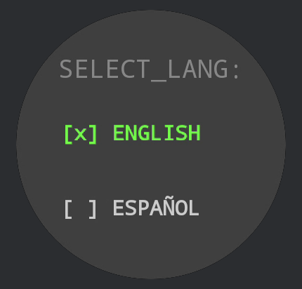
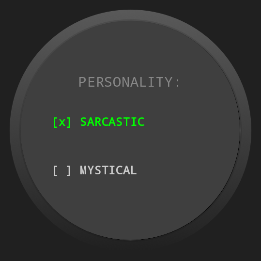
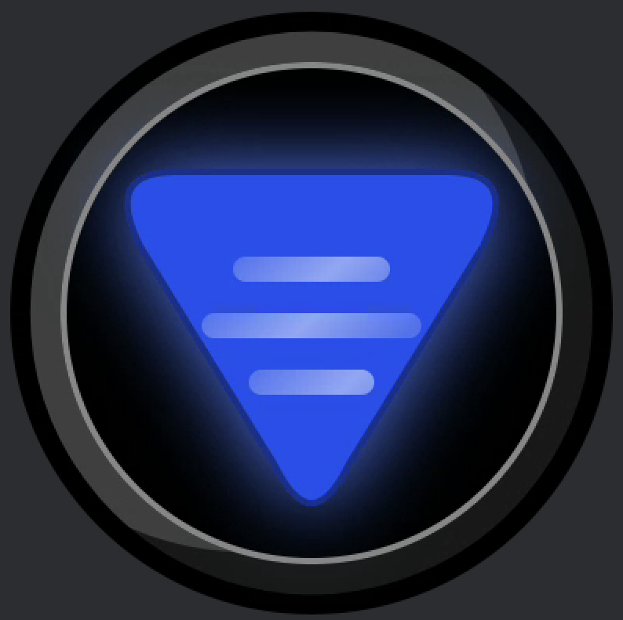

# Magic 8 Ball Wear OS 🎱

**Author:** Lorenzo Suarez

An advanced, AI-powered decision-making companion built exclusively for Wear OS. This application modernizes the classic Magic 8 Ball experience by fusing nostalgic charm with the cutting-edge intelligence of Google's Gemini Large Language Model, all wrapped in a premium, console-inspired interface.

## Overview 🚀

Magic 8 Ball Wear OS goes beyond simple random responses. It features a **Hybrid Intelligence** system that intelligently switches between a local deterministic engine for instant offline answers and a cloud-based Gemini AI for creative, context-aware predictions. The UI is meticulously crafted with physics-based animations, adaptive typography, and a "Matrix-green" console aesthetic that feels right at home on modern smartwatches.

## User Interface & Flow 📸

Experience the complete journey from startup to prediction.

| Splash | Home | Language | AI personality | Shake / Touch | Reveal |
|:---:|:---:|:---:|:---:|:---:|:---:|
|  |  |  |  |  |  |

### Live Demo


*Real-time physics and API interaction*

*(Please rename your screenshots to match: `splash_screen.png`, `language_selection.png`, `thinking_state.png`, `prediction_result.png`, and `demo.gif`)*

## Key Features ✨

*   **🧠 Hybrid AI Engine**:
    *   **Local Fallback**: Instant, zero-latency responses using a local database when offline.
    *   **Cloud Intelligence**: Taps into the Gemini API for unique, witty, and varied predictions when connected.
    *   **Smart Retry Policies**: Robust network handling with exponential backoff and strict safety filters.

*   **🎨 Premium Wear OS Experience**:
    *   **Physics-Based Animation**: The signature blue triangle floats and settles with realistic spring dynamics.
    *   **Console Aesthetic**: A retro-futuristic language selection screen with monospace typography and green accent highlights.
    *   **Haptic Feedback**: Subtle vibrations enhance the tactile feel of shaking the device or receiving an answer.

*   **📐 Adaptive Typography**:
    *   **Auto-Sizing Text**: A custom `AutoSizingTextContainer` uses binary search algorithms to fit predictions of any length perfectly within the inverted triangle geometry without truncation.
    *   **Dynamic Gravity**: Text naturally "floats" to the visual center but adapts its position based on phrase length and triangle width.

*   **🌍 Multi-Language Support**:
    *   Seamlessly toggle between **English** and **Spanish**.
    *   **Dynamic System Prompts**: The AI's personae and language instructions are injected dynamically based on user preference.

## Tech Stack 🛠️

Built with modern Android development standards and best practices:

*   **Language**: [Kotlin](https://kotlinlang.org/) (v2.0+)
*   **UI Framework**: [Compose for Wear OS](https://developer.android.com/training/wearables/compose) (Material 3)
*   **Architecture**: Clean Architecture + Multi-Module (Modularization by Layer & Feature)
*   **Dependency Injection**: [Hilt](https://dagger.dev/hilt/)
*   **Networking**: [Retrofit](https://square.github.io/retrofit/) + [OkHttp](https://square.github.io/okhttp/)
*   **AI Integration**: [Google Gemini API](https://ai.google.dev/)
*   **Concurrency**: Kotlin Coroutines & Flow
*   **Serialization**: Kotlinx Serialization

## Architecture 🏗️

The project follows a strict **Clean Architecture** pattern, modularized to separate concerns and ensure scalability:

```text
:app-wear           # Application entry point & DI orchestration
├── :feature:chat   # Presentation layer (UI, ViewModel)
├── :core:domain    # Business logic (UseCases, Repository Interfaces, Policies)
├── :core:data      # Data implementation (Repositories, DataSources, API)
├── :core:network   # Network infrastructure (Retrofit, OkHttp, API Keys)
├── :core:motion    # Sensor logic & Shake detection strategy
├── :core:common    # Shared utilities & configurations
└── :core:designsystem # Theming, Color, Type
```

## Setup & Configuration ⚙️

This project requires a valid Google Gemini API key to function fully.

1.  **Clone the Repository**:
    ```bash
    git clone https://github.com/LorenzoSuarez/MagicEightBall.git
    ```

2.  **Generate an API Key**:
    Obtain a free API key from [Google AI Studio](https://aistudio.google.com/).

3.  **Secure Your Key**:
    Create a `local.properties` file in the project root (this file is git-ignored):
    ```properties
    # local.properties
    GEMINI_API_KEY=your_api_key_starts_with_AIza...
    ```

4.  **Build & Run**:
    Open the project in Android Studio (Koala or later recommended) and deploy to a Wear OS emulator or physical device.

## License 📄

Copyright © 2024 **Lorenzo Suarez**. All rights reserved.
